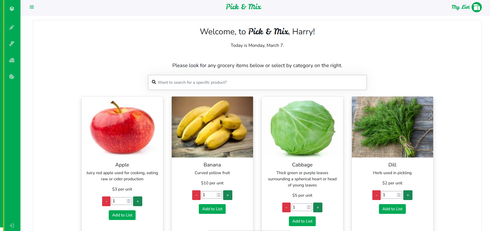
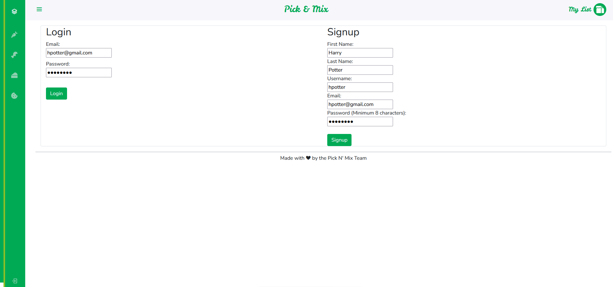
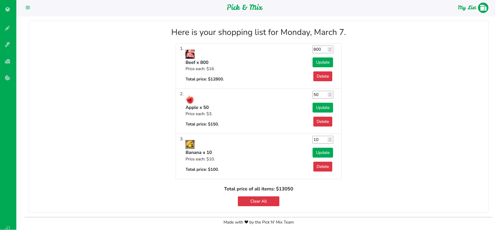

# Grocery Shopping List

## Description

It's an app where you can look at groceries and their categories, and put items and the quantity into a list that the user can later look at. The list is tied to a user's account, so in order to use the app, a user must be logged in first. 

> Github Repository Link: [https://github.com/MpAlfano/Grocery-Store](https://github.com/MpAlfano/pick-n-mix)
>
> Deployed App (Heroku) Link: [https://pick-n-mix.herokuapp.com/](https://pick-n-mix.herokuapp.com/)

## Table of Contents

1. [Installation](#installation)
2. [Usage](#usage)
3. [Example](#example)
4. [Technologies Used](#technologies-used)
5. [License](#license)
6. [Contributions/Questions](#contributionsquestions)

## Installation

Type "npm install" in the console to install the dependancies that this application requires (Express, MySQL2, Dotenv, Sequelize, bcrpyt, session, handlebars, Day.js, etc.). You would also need a MySQL server running to be able to create and seed the database with.

## Usage

In order to run this program, a couple things need to be done. Firstly, the user must create a database by logging into their mySQL server ("mysql -u root -p" in a terminal), then typing "source ./db/schema.sql". Secondly, type "npm run seed" in the another console (or quit out of your sql terminal first) to seed the database with some items. Thirdly, type "npm start" to run the server. Your localhost:3001/ URL will now have the site deployed.

Alternatively, check out the deployed Heroku link if you wish to utilize the site but do not want your own copy.

## Example

### Homepage

### Login/Sign Up Page

### Shopping List Page

## Technologies Used 

* bcrypt
* bootstrap
* connect-session-sequelize
* dayjs - (New technology, for date and time formatting)
* dotenv
* express
* express-handlebars
* express-session
* mysql2
* nodemon
* node
* npm
* sequelize

## License

This project is under the Apache License. 

## Contributions/Questions

These were the contributers for the application: 

* Mark Alfano: (Github: [MpAlfano](https://github.com/MpAlfano), Email: Mpalfano4@gmail.com)
* Bilal Raza: (Github: [Bickolus](https://github.com/Bickolus), Email: smbraza97@gmail.com)
* Shanchai Zahid: (Github: [ShanchaiZ](https://github.com/ShanchaiZ), Email: shanchai.zahid@gmail.com)
* Yaregal (Github: [Yaregal](https://github.com/Yaregaldt), Email: dyaregal@gmail.com)

If you have any additional questions about this application, please feel free to contact any of the members above.
